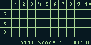
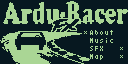
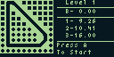
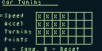
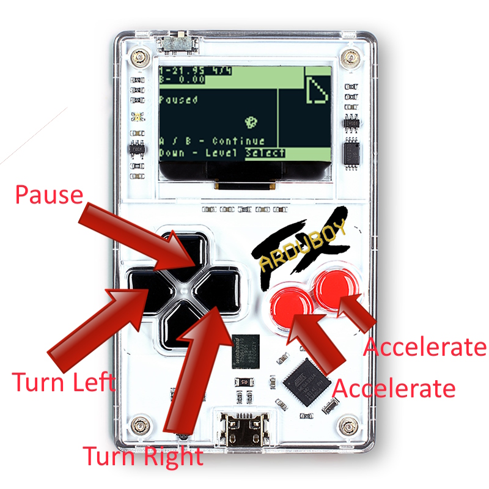
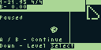
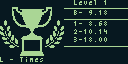

  

# Ardu Racer FX 🏎️

**Introduction**

A time trail game, not for the faint of heart. Get your heart pumping, get your game face on and gun it down the striaghts and hammer it in the corners.

This is a port of [ArduRacer](https://community.arduboy.com/t/arduracer-a-trackmania-type-time-trial-game/8850) which includes usage of the FX chip on the ArduboyFX!

**Gameplay**

## New FX Features
- Locked 60 FPS gameplay
- 20 Stages
- Beat the Dev Times
  - 1st place is the best time possible with tuning and shortcuts
  - 2nd place is the best time possible with no tuning and shortcuts
  - 3rd place is a chosen time which should be possible with no tuning and no shortcuts and some leeway
  - All times were done on an ArduboyFX, not using an emulator. Wanted to keep the playing field fair
- Bigger maps for later levels
- Car Tuning for optimising the performance to your preference or the track
- 2x frames on car to track 16 directions
- Integrated Map to give you some information on upcoming turns
- Much smoother intro zoom animations

## Technical callouts
- 50kb of assets
- FX Bitmap streaming of tiles
- Locked 60 FPS
- Much smoother map zoom using mip mapped tiled animation
- ArduBitmap ported to FX for offloading assets
- Car Tuning feature
- FX Save feature, no more eeprom issues
- Integrated Map using dynamic map cache for high speed drawing
- Bigger maps
- Allowing timing up to 99.99 seconds

## Original Game Features
- 30+ fps gameplay
- 10 stages
- 3 times to beat per stage, beat the 3rd best time to progress to the next stage
- Track view prior to starting race
- Speedometer to track you roaring engine
- Dynamic zoom into level to see your start

# System requirements

This game requires the ArduboyFx to play, as it far exceeds the space limits of the original Arduboy and loads most of it's assets from the Fx chip in the ArudboyFX. Since this game is a Fx game, I would reccomend using a cart builder like [this](http://www.bloggingadeadhorse.com/cart/Cart.html). It will hopefully be added to a cart or two, but until then you can upload yourself and choose the a bunch of games to load onto the cart. Instructions for loading a compilation cart are [here](https://community.arduboy.com/t/arduboy-fx-cart-builder/10395).

If you have an Arduboy please go see the original game, ArduRacer, which has the same gameplay and a lot of the same features.

If you don't have an ArduboyFx and would like to play give it a go in Arderns, you can download a release from the releases, unzip it, and drag the .bin and .hex file into this website. 

[Arderns Web Player](https://tiberiusbrown.github.io/Ardens/player.html)

You can read more about this awesome piece of software [here](https://community.arduboy.com/t/ardens-arduboy-simulator-for-profiling-and-debugging/10833) and [here](https://github.com/tiberiusbrown/Ardens)

# Game Instructions

Welcome to ArduRacerFx, I hope you have a great time playing it. To help with getting to that great time, this might help you with some of the features and gameplay

## Main menu
  

Options are:

- **Continue**
  - Start at the max level you haven't completed yet.
- **Start**
  - Start at level 1
- **Trophies**
  
  

  - See your medals for each level, Gold (G), Silver (S) and Bronze (B)
  - Level numbers on the top of the screen
  - Left and right keys will switch you between level 1-10 and level 11-20
  - B Key to go back to main menu
- **Options**

  
  
  - About screen - Some deets (not many, about me)
  - Music - Toggle music on and off with A button
  - Sfx - Toggle sound on and off
  - Map - Toggle the in game map and on off, depending on preferences.

# Level Select

### On screen
- Level number header bar
- B- Your best lap time on the stage
- 1/2/3- The 3 best times, beat the 3rd
- Mini-map display on the left of the stage
- Info display at the bottom

### Controls

- Up - Go to next level, if it's unlocked
- Down - Go to previous level.
- Left to enter tuning mode
- A to start

# Car Tuning Mode
## Screen Layout

Your car has a single saved setup, once setup it will apply to all stages.
- There are 4 bars
  - Speed    - Top speed of your car, default 4/7
  - Accel    - How fast your car can go from zero to hero, default 4/7
  - Turning  - Determines how quickly your car can turn a corner, default 4/7
  - Points   - Free points available to allocation

Each point is worth a 10% change in the item you are modifying

**Example 1:** taking one point away from turning, will decrease your turning speed by 10%, and adding it to Speed will increase your maximum speed by 10%. Don't leave any points unassigned, essentially you're leaving free performance on the floor at that point.

**Example 2:** Taking two points from acceleration and one point away from turning, and adding all 3 points 
to top speed will result in. 30% increase in top speed, 20% decrease in acceleration and a 10% decrease in turning speed.

## Controls
  - Left - Take a point away from the currently selected item, must have points on the item you're decreasing
  - Right - Add a point to the currently selected item, must have points available in the bottom bar
  - A - Save setup and return to Level Select.
  - B - Reset to default.

# Gameplay

Finally the game! Play play play.

Your objective is to get the fastest single lap time you can, in the 5 lap race. Your best time will be the one compared against the top 3 set times.

If you best 3rd place, you've beaten what I thought was a fair time after playing the game many, many, many, many times and will proceed to the next stage.

If you beat the 2nd place time, you will have beaten the best time I could get with an untuned car using shortcuts.

If you beat 1st place, you beat the best time I could get, with the best tuning and any shortcuts on the track.

## Controls

### In game

- Left - Turn left
- Right - Turn right
- A - Accelerate
- B - Accelerate (after months of testing, I decided you don't need brakes, and I didn't have space for an option to swap )
- Up - Pause the game

### Pause menu controls

- A or B - Continue
- Down - Return to level select, if you had recorded a best lap it will still be saved.

### HUD On screen while racing

- Top Left line (example above) "1-21.95 4/4"
  - "1" - The lap number you're on, of 5
  - "21.95" - Your current lap time
  - "4/4" - First number is how many checkpoints you have passed, 2nd number is how many checkpoints there are.

- Line below (example above) "B- 0.00"
  - "B" - Will be B or *
    - "B" - The lap time shown is your current saved best lap time
    - "*" - You have beaten your best lap ever!

- Top Right - Bar indicates your speed
- Below - Minimap showing 10 x 10 tiles of the current map, moving with you
  - On the early stages, you can see the whole stage in this view.
  - On the later and bigger stages (Level 11+) later on, this will show the 10x10 grid around your car
  - Flickering dot is your player location
  - White blocks are track pieces (may not always be part of your track, but I tried)
  - Black blocks are considered off road pieces.

### Racing and the track

In the track example above, the white line across the track is the start / finish line. Black track is on road. White track is offroad, you will incur a major speed penalty for going offroad.

There are track pieces which have bars along the sides, these are markers for the checkpoints. Quite often they will be just before a corner to be used as a marker.

## Win screen

- B - Your best time
- 1/2/3 - Top games

### Controls
- Left - See all your lap times
- Right - Come back to this screen from lap times.
- A - Next level
- B - Restart level

